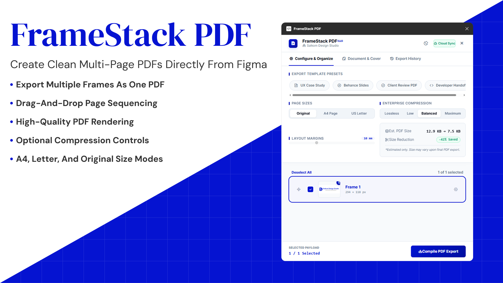

# FrameStack PDF

**Export multiple Figma frames into a single PDF — with a cover page, custom filename, and one-click re-download.**

[](https://www.figma.com/community/plugin/1638543298157640831)
[](./LICENSE)

FrameStack PDF is a Figma plugin that solves a fundamental gap in Figma's native export: **Figma can only export one frame as one PDF**. FrameStack lets you select any number of frames, stack them into a single multi-page PDF, add a cover page with custom text, name the file whatever you want, and re-download any previous export from history — without rearranging your frames again.



---

## The Problem It Solves

Figma's built-in PDF export creates one PDF per frame. If you have a 10-screen presentation or a multi-page deck, you get 10 separate files. There is no native way to combine multiple frames into one PDF, add a cover page, or name the output file.

FrameStack PDF fixes all of that:

- **Multiple frames → one PDF** — select any number of frames and export them as a single, properly ordered multi-page PDF
- **Cover page** — add a cover page with custom text at the front of the PDF, without needing a dedicated cover frame on your canvas
- **Custom filename** — name the PDF whatever you want before downloading
- **Export history** — every export is saved; re-download any previous PDF directly without selecting and arranging frames again
- **Per-frame control** — reorder frames by dragging, exclude specific frames, override page size per frame, and toggle bleed for print-ready output
- **Compression control** — adjust image quality to balance file size against visual fidelity

---

## Features

### Configure Tab

The primary workspace where you build your export.

**Page size presets** — apply standard sizes across all frames in one click: A4, A3, US Letter, US Legal, Tabloid, and Presentation (16:9).

**Page orientation** — toggle between Portrait and Landscape via a segmented control.

**Image quality** — a range slider controls JPEG compression quality. The estimation box updates live to show approximate output size and compression ratio.

**Frame list** — all frames from your Figma selection appear as cards, each showing:

- A live thumbnail rendered from the frame
- Frame name and pixel dimensions
- An order badge showing its position in the final PDF
- A drag handle for reordering
- A checkbox to include or exclude it
- A settings trigger for per-frame overrides

**Per-frame overrides** — expand any frame card to override its page size and orientation independently of the global setting, and toggle bleed on or off per frame. Override frames are tagged inline so you can spot mixed configurations at a glance.

**Select all / deselect all** — toggle all frames in one action from the frame list toolbar.

### Document Tab

Set the PDF filename and add an optional cover page with custom text. Also supports optional PDF metadata — title, author, subject, and keywords — embedded directly into the file properties.

### History Tab

Every export is automatically saved. Each history entry shows the filename, page count, and timestamp, with a re-download button to fetch the file again immediately — no need to re-select frames, re-configure settings, or re-arrange order.

The full history can be cleared in one action.

---

## How It Works

```
Figma Canvas
     │
     │  Plugin reads selected frames via Figma Plugin API
     ▼
code.js  (Plugin sandbox — has Figma document access)
     │
     │  Exports each frame as PNG image data via figma.exportAsync
     │  Sends frame images, names, and dimensions → UI
     ▼
ui.html  (Plugin UI — runs in sandboxed iframe)
     │
     │  Renders frame cards with thumbnails
     │  User configures: order, page sizes, quality,
     │                   cover page text, filename, metadata
     │
     │  On export → jsPDF assembles pages in sequence:
     │    1. Cover page (if enabled) with custom text
     │    2. Each selected frame as a PDF page, in defined order
     │       with per-frame size, orientation, and bleed applied
     │    3. PDF metadata attached
     ▼
Single PDF file downloaded to user's machine
     │
     └─ Export saved to History tab for re-download
```

The plugin runs across two execution contexts required by the Figma Plugin API. **`code.js`** runs in the plugin sandbox with direct Figma document access — it reads selected frames and exports image data. **`ui.html`** runs in an iframe and handles the entire configuration UI and PDF assembly via jsPDF, communicating with `code.js` through the `postMessage` API.

---

## File Structure

```
SDS-FrameStack-PDF/
├── code.js           # Plugin sandbox — Figma API access, frame export
├── ui.html           # Plugin UI — configuration interface, jsPDF assembly
├── manifest.json     # Figma plugin manifest
├── logo.svg          # Plugin icon (vector)
├── logo.png          # Plugin icon (raster)
└── image-preview.png # Repository preview image
```

---

## Installation

### From the Figma Community

Search for **FrameStack PDF** in the Figma Community plugins directory, or install directly via plugin ID `1638543298157640831`.

### Running Locally (Development)

1. Clone the repository:

```bash
git clone https://github.com/salkomdesignstudio/SDS-FrameStack-PDF.git
```

2. In Figma Desktop, go to **Plugins → Development → Import plugin from manifest…**

3. Select `manifest.json` from the cloned folder.

The plugin appears under **Plugins → Development** and runs on any Figma file. No build step required — it runs directly from `code.js` and `ui.html`.

---

## Usage

1. Select all the frames you want in your PDF.
2. Run **FrameStack PDF** from the Plugins menu.
3. In the **Configure** tab: reorder frames by dragging, deselect any to exclude, adjust page size and quality.
4. In the **Document** tab: set the PDF filename, add a cover page with custom text, and optionally fill in metadata.
5. Click **Export PDF** — a single PDF containing all selected frames downloads immediately.
6. Find the export in the **History** tab to re-download it anytime without starting over.

---

## Technical Details

| Detail           | Value                                                                              |
| ---------------- | ---------------------------------------------------------------------------------- |
| Figma Plugin API | `1.0.0`                                                                            |
| PDF engine       | [jsPDF 2.5.1](https://cdnjs.cloudflare.com/ajax/libs/jspdf/2.5.1/jspdf.umd.min.js) |
| Supported editor | Figma (not FigJam)                                                                 |
| Network access   | `cdnjs.cloudflare.com`, `cdn.jsdelivr.net`                                         |
| Document access  | `dynamic-page`                                                                     |
| Dark mode        | Supported                                                                          |

---

## License

MIT © [Salkom Design Studio](https://salkomdesignstudio.com)

---

Built by **Govarthanan** — UI/UX Designer & Frontend Developer at [Salkom Design Studio](https://salkomdesignstudio.com), Chennai.
